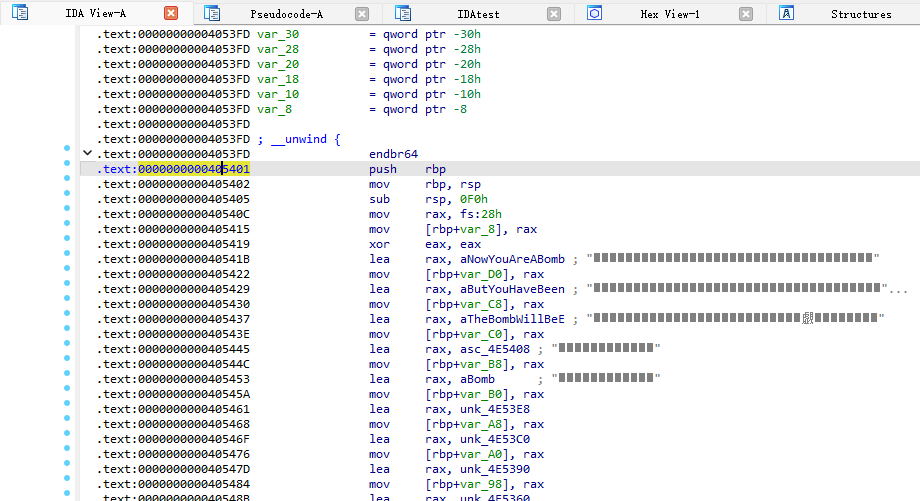
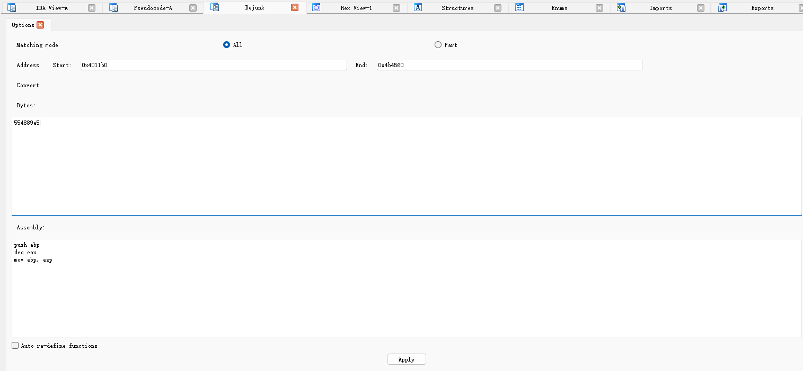
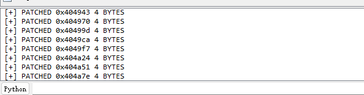
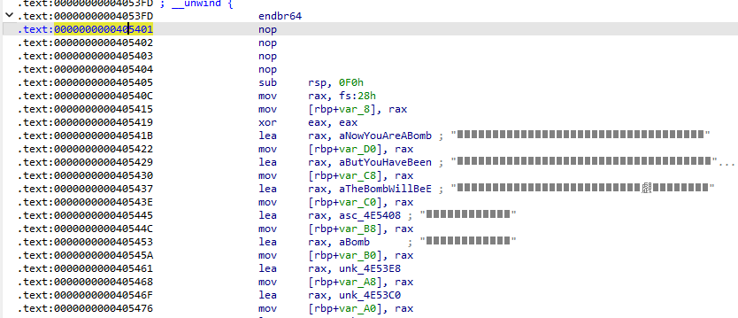

# Dejunk
An ida plug-in that matches the bulk removal of junk instructions from the program | 批量匹配去除花指令的ida插件

## Install

1. put `Dejunk.py` into `plugins` folder under your IDA Pro installation path.|将`Dejunk.py`放到IDA安装目录下的`plugins`文件夹中

## Features

- All match

  - Get the instruction of the user input, start address, end the address, and use IDA's search API to remove|获取用户输入的指令，起始地址，结束地址，利用ida的搜索api来移除

  - Before:

    

    

  - After:

    

    

- Partial match
  - Use regular expressions to match the machine code corresponding to the junk instruction|使用正则表达式来匹配垃圾指令对应的机器码

- Assembly/Machine Code Converting to each other|汇编机器码互相转换
- Automatic re-definition function (TODO)|自动重定义函数（待完成）
- Right-click the instructions in the assembly interface to fill in the plug-in (TODO)|汇编界面选中指令右键填入插件（待完成）

